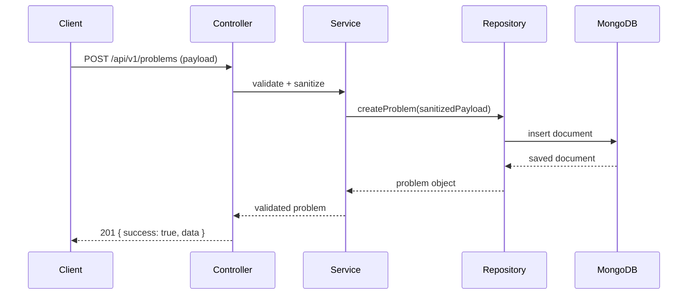
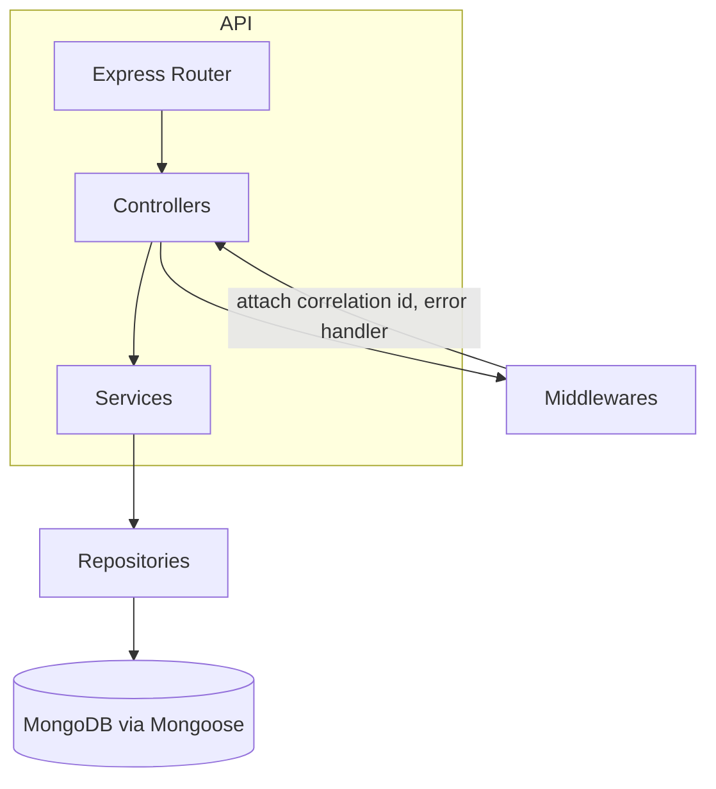

# Codeduck — Problem Service

Lightweight REST API for managing programming problems. This service provides endpoints to create, read, update, delete and search coding problems.

## Quick start

1. Clone the repository

```bash
git clone https://github.com/Somilg11/codeduck-problem-service
```

2. Install dependencies

```bash
npm install
```

3. Create a `.env` file (optional)

By default the server runs on port `3001`. To override, create `.env` with:

```bash
PORT=3001
DB_URL=mongodb://localhost:27017/problem-service
```

4. Start the server

```bash
npm run dev
```

The API will be available at `http://localhost:3001/api/v1` by default.

## Tech stack & libraries

- Runtime: Node.js + TypeScript
- Web framework: Express (v5)
- Input validation: Zod
- Database: MongoDB via Mongoose
- Markdown handling: marked, turndown, sanitize-html (used in `sanitizeMarkdown` util)
- Logging: winston + winston-daily-rotate-file
- UUID generation: uuid
- Dev tools: ts-node, nodemon, TypeScript

Dependencies (from package.json):

- dotenv
- express
- marked
- mongoose
- sanitize-html
- turndown
- uuid
- winston
- winston-daily-rotate-file
- zod

Dev dependencies:

- @types/express, @types/node, @types/sanitize-html, @types/turndown, nodemon, ts-node, typescript

## High-level architecture & flow

The service follows a controller -> service -> repository pattern.

### Sequence flow (create problem)



### Component diagram



## Endpoints (v1)

Base path: `/api/v1`

- GET `/ping` — returns `{ message: 'Pong!' }`
- GET `/ping/health` — returns `OK` (text)
- POST `/problems` — create a problem. Body shape (JSON):

```json
{
	"title": "Sum Two Numbers",
	"description": "Given two numbers, return their sum.",
	"difficulty": "easy",
	"editorial": "Optional editorial text",
	"testcases": [{ "input": "1 2", "output": "3" }]
}
```

- GET `/problems` — list all problems
- GET `/problems/:id` — fetch a single problem by id
- PUT `/problems/:id` — update fields (partial)
- DELETE `/problems/:id` — delete a problem
- GET `/problems/difficulty/:difficulty` — where difficulty is `easy|medium|hard`
- GET `/problems/search?q=...` — search by title or description

## Postman collection
There is a Postman collection included in the repository: `postman_collection.json` and a short usage doc `postmn.md`.

Import it into Postman and run the requests. The Create Problem request saves the created `_id` into the collection variable `problemId` to use in subsequent requests.

## Tests and validation
- Input validation is done using Zod schemas located in `src/validators`.
- The model includes schema validation and indexes (unique title index) in `src/models/problem.model.ts`.

## Notes & tips
- The model enforces unique titles — if you hit a duplicate key error when creating a problem, change the title.
- Markdown fields are sanitized before saving via `sanitizeMarkdown` utility to avoid XSS.

## Contributing
- Fork the repo, create a feature branch, add tests, and open a PR.

---

If you'd like, I can also:
- Add a Postman environment JSON to the repo.
- Add a Newman npm script to run the collection in CI.
- Generate PlantUML or PNG exports of the diagrams and add them to the docs.
